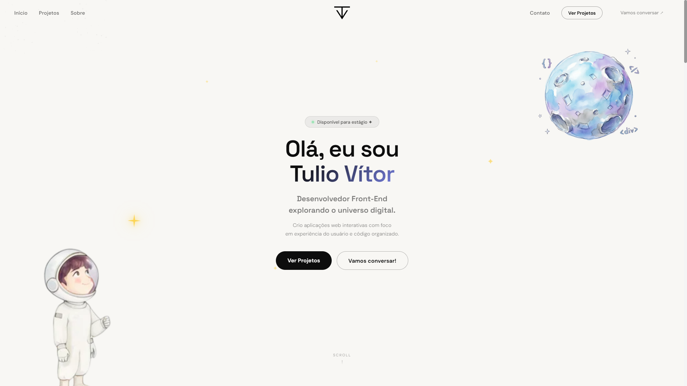
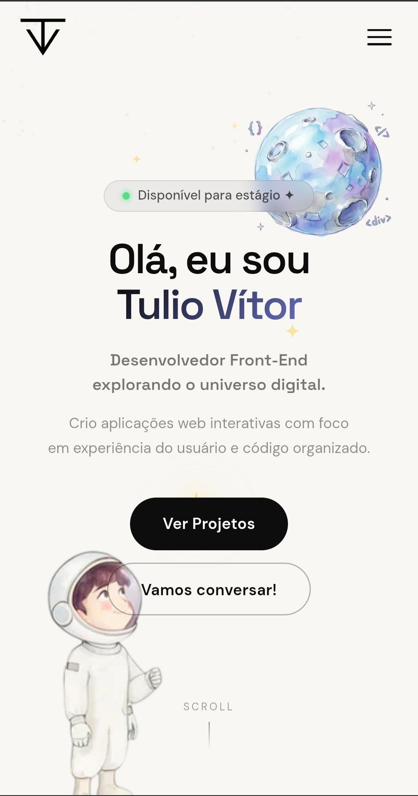

<div align="center">

# 🌟 Tulio Vítor | Portfólio

**O próprio portfólio. Construído do zero, com referências reais e decisões técnicas intencionais.**



[](https://tuliovitor.github.io)
[](https://developer.mozilla.org/pt-BR/docs/Web/HTML)
[](https://developer.mozilla.org/pt-BR/docs/Web/CSS)
[](https://developer.mozilla.org/pt-BR/docs/Web/JavaScript)
[](https://gsap.com/)
[](https://lenis.darkroom.engineering/)

</div>

---

## 📌 Sobre o projeto

Este é o portfólio pessoal de Tulio Vítor — desenvolvido do zero com base em referências de portfólios profissionais bem estruturados, buscando o primeiro estágio como desenvolvedor front-end.

O objetivo foi construir algo que funcionasse como um argumento visual: uma página que demonstre domínio de animação, layout, interação e organização de código antes mesmo de qualquer conversa. O portfólio exibe 17 projetos reais com modal de detalhes, seção sobre com carrossel de fotos, CTA com partículas, header adaptativo por seção e smooth scroll via Lenis integrado ao GSAP.

---

## 🎬 Demonstração

| Desktop | Mobile |
|---|---|
|  |  |

---

## ✨ Funcionalidades

- **Hero com astronauta e planeta flutuantes** — animações em loop `yoyo` via GSAP, partículas sutis em canvas, badge "Disponível para estágio" com dot pulsante e dois botões com flip de texto no hover
- **Grid de 17 projetos** — hover revela overlay com nome, seta para o site ao vivo, ícone de informações e tech tags; no mobile, o primeiro toque revela o overlay e o segundo abre o site
- **Modal de projeto com carrossel** — abre com animação `scale + opacity` via GSAP, exibe imagens em carrossel com setas, dots e swipe, e diferencia automaticamente projetos de design (Figma) dos projetos com deploy
- **Header adaptativo por seção** — muda entre `header-light` e `header-dark` conforme a seção visível na viewport, com efeito glassmorphism ao scrollar, sem depender de scroll simples
- **Smooth scroll via Lenis** — integrado ao `gsap.ticker.add` em vez de `requestAnimationFrame` independente, com `lenis.on('scroll', ScrollTrigger.update)` para sincronização perfeita com as animações
- **Dois canvases de partículas independentes** — hero com partículas escuras sutis em fundo claro, seção CTA com partículas roxas semitransparentes em fundo escuro, ambos com resize responsivo
- **Carrossel de fotos com drag** — na seção Sobre, suporta clique nos dots, drag no mouse e swipe no touch, com autoplay a cada 5s e pausa automática durante a interação
- **Menu mobile com Lenis bloqueado** — ao abrir o menu hamburger, `lenis.stop()` previne scroll no fundo; `lenis.start()` é chamado ao fechar ou navegar para uma seção
- **Microsoft Clarity integrado** — rastreia via `clarity('event', ...)` qual projeto teve o modal aberto (ícone ⓘ) e qual teve o site ao vivo acessado (clique direto), permitindo análise de quais projetos geram mais interesse

---

## 🧱 Stack

| Tecnologia | Uso |
|---|---|
| HTML5 semântico | Estrutura completa: header, seções, modal, footer, canvas |
| CSS3 | Layout responsivo, glassmorphism, hover states, animações keyframe |
| JavaScript vanilla | Toda a lógica de interação, modal, carrossel, partículas e header |
| GSAP 3 + ScrollTrigger + ScrollToPlugin | Animações de entrada, scroll suave para âncoras, animações do modal |
| Lenis | Smooth scroll sincronizado ao ticker do GSAP |
| Microsoft Clarity | Analytics de comportamento: heatmap, gravações e eventos customizados |

---

## 🗂️ Estrutura do projeto

```
portfolio/
├── index.html         # Estrutura completa: header, hero, projetos, sobre, CTA, footer, modal
├── scripts.js         # 13 módulos init + array PROJECTS com todos os dados dos projetos
├── styles.css         # Layout responsivo, header states, modal, carrossel, grid de projetos
└── assets/
    ├── tv-logo-preloader-branca.svg
    ├── tv-logo-preloader-preta-v2.svg
    ├── code-planet-dark.webp
    ├── tulio-astro.webp
    ├── mockup-projeto01…18.webp
    ├── tulio-formal.webp / tulio-casual.webp / setup.webp …
    └── preview-desktop.png / preview-mobile.jpg
```

---

## 🧠 Decisões técnicas

### Array `PROJECTS` como fonte única de verdade

Todos os dados dos 17 projetos — nome, imagens, URL de deploy, URL do GitHub, stack e descrição — ficam em um único array de objetos no topo do `scripts.js`. O HTML dos cards do grid contém apenas a imagem e os atributos `data-project`; o modal é populado dinamicamente:

```javascript
const PROJECTS = [
  {
    name: 'Stranger Things Experience',
    images: ['assets/mockup-projeto01.webp'],
    url: 'https://tuliovitor.github.io/stranger-things',
    github: 'https://github.com/tuliovitor/stranger-things',
    tech: ['HTML', 'CSS', 'JavaScript', 'GSAP'],
    desc: 'Landing page temática...',
  },
  // ...
];
```

Adicionar um novo projeto ao portfólio é uma mudança em dois lugares: um novo objeto no array e um novo card no HTML. A lógica do modal, dos botões e das tags é reutilizada automaticamente.

---

### Header adaptativo por seção via `getBoundingClientRect`

O header não usa apenas `window.scrollY` para mudar de tema — ele lê a posição das seções em tempo real para saber exatamente quando está sobreposto a um fundo escuro:

```javascript
function updateHeader() {
  const isOnDark =
    (projRect && projRect.top <= 72 && sobreRect && sobreRect.top > 72) ||
    (ctaRect && ctaRect.top <= 72) ||
    (footerRect && footerRect.top <= 72);

  if (isOnDark) {
    header.className = 'header-dark header-scrolled';
  } else {
    const y = window.scrollY;
    header.className = y > 80 ? 'header-light header-scrolled' : 'header-light';
  }
}
```

Isso significa que o header muda de cor no exato momento em que a borda de uma seção escura passa pelo topo da viewport — não antes, não depois. `header-light` e `header-dark` são classes CSS distintas que redefinem a cor do logo, dos links e dos botões simultaneamente.

---

### Comportamento de dois estágios no mobile para os cards

No desktop, clicar em um card abre o site ao vivo diretamente. No mobile, não há hover — então o primeiro toque revela o overlay com nome, seta e ícone de informações; o segundo toque abre o site:

```javascript
if (window.innerWidth <= 768) {
  if (!card.classList.contains('touched')) {
    $$('.project-card.touched').forEach(c => c.classList.remove('touched'));
    card.classList.add('touched');
  } else {
    window.open(project.url, '_blank', 'noopener,noreferrer');
  }
}
```

Tocar fora de qualquer card remove a classe `touched` de todos, limpando o overlay. Esse comportamento garante que o usuário mobile veja o nome do projeto e as tech tags antes de ser redirecionado — replicando a experiência informativa do hover sem depender de `:hover`.

---

### Lenis integrado ao ticker do GSAP, não ao `requestAnimationFrame` independente

A integração do Lenis com o GSAP não usa o loop padrão do Lenis — usa o ticker do GSAP como driver:

```javascript
gsap.ticker.add(time => lenisInstance.raf(time * 1000));
gsap.ticker.lagSmoothing(0);
lenisInstance.on('scroll', ScrollTrigger.update);
```

Isso garante que o Lenis, o GSAP e o ScrollTrigger compartilhem o mesmo frame de atualização. Sem isso, animações scrub-based podem tremer ou atrasar porque o ScrollTrigger leria a posição de scroll em um frame diferente do que o Lenis acabou de atualizar.

---

### Modal com diferenciação automática para projetos de design

O modal detecta se o projeto usa Figma/UI Design e ajusta os botões de ação antes de exibir:

```javascript
if (project.tech.includes('Figma') || project.tech.includes('UI Design')) {
  liveBtn.querySelector('.btn-text-top').innerHTML = 'Ver no Figma ↗';
  githubBtn.querySelector('.btn-text-top').innerHTML = 'Acessar Design';
}
```

O reset para o padrão acontece sempre que o modal abre, antes de qualquer verificação — para evitar que um projeto de design aberto anteriormente deixe o texto errado no próximo modal. Um detalhe pequeno, mas que previne um bug silencioso de estado sujo entre aberturas.

---

### Analytics comportamental com Microsoft Clarity

Além das métricas padrão (pageviews, sessões), o Clarity recebe eventos nomeados em pontos estratégicos de interação:

```javascript
// Ícone ⓘ abre o modal
clarity('event', `modal_${project.name.replace(/\s+/g, '_')}`);

// Clique direto abre o site ao vivo
clarity('event', `visit_${project.name.replace(/\s+/g, '_')}`);
```

Isso permite comparar quais projetos geram mais cliques diretos (interesse imediato) versus mais aberturas de modal (interesse em entender melhor). Os dados de heatmap do Clarity também revelam padrões de scroll e áreas de maior atenção — informações que guiam iterações futuras do portfólio.

---

## ⚙️ Como usar

1. Clone o repositório e abra o `index.html` no navegador
2. Para adicionar um novo projeto: inclua um objeto no array `PROJECTS` em `scripts.js` e um novo `.project-card` no HTML com `data-project` apontando para o índice correto
3. Para atualizar as fotos do carrossel da seção Sobre: substitua os arquivos em `assets/` com os nomes correspondentes

---

## 📈 Processo de desenvolvimento

| Etapa | O que foi feito |
|---|---|
| 01 | Pesquisa e curadoria de referências de portfólios profissionais |
| 02 | Definição da paleta, tipografia (Space Grotesk + DM Sans) e estrutura de seções |
| 03 | Hero com astronauta, planeta, badge e botões com flip de texto |
| 04 | Canvas de partículas para hero e CTA com configuração por parâmetros |
| 05 | Grid de projetos com overlay hover, tech tags e comportamento mobile de dois estágios |
| 06 | Modal com carrossel de imagens, GSAP de entrada/saída e diferenciação para design |
| 07 | Array `PROJECTS` centralizado como fonte única de dados |
| 08 | Header adaptativo por seção via `getBoundingClientRect` |
| 09 | Integração Lenis + GSAP ticker + ScrollTrigger sincronizado |
| 10 | Carrossel de fotos com drag, swipe e autoplay |
| 11 | Menu mobile com bloqueio de scroll via `lenis.stop()` |
| 12 | ScrollTrigger para animações de entrada em todas as seções |
| 13 | Microsoft Clarity com eventos customizados por projeto |

---

## 💡 O que eu aprenderia diferente

- O array `PROJECTS` está declarado no topo do `scripts.js` com todos os 17 projetos inline. Teria movido os dados para um arquivo `projects.js` separado e importado com `type="module"` — separando configuração de lógica e facilitando a manutenção à medida que o portfólio cresce
- A função `updateHeader` é chamada em todo evento de `scroll` e recalcula `getBoundingClientRect` de quatro elementos por frame. Teria usado um `IntersectionObserver` para cada seção-chave, evitando leituras de layout forçadas a cada scroll
- O comportamento mobile de "dois toques" funciona bem, mas a classe `touched` é controlada via `classList` espalhado por dois listeners. Teria centralizado em um único gerenciador de estado para o card ativo — mais fácil de debugar e de estender para novos comportamentos de toque no futuro

---

## 👨‍💻 Autor

**TULIO VITOR**

[](https://linkedin.com/in/tuliovitor)
[](https://github.com/tuliovitor)

---

<div align="center">

Feito com muito ☕ e muito 🚀 — do zero, com referências reais e propósito claro

</div>
